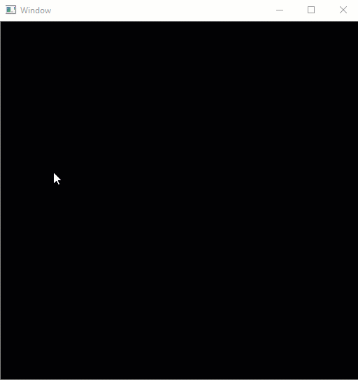
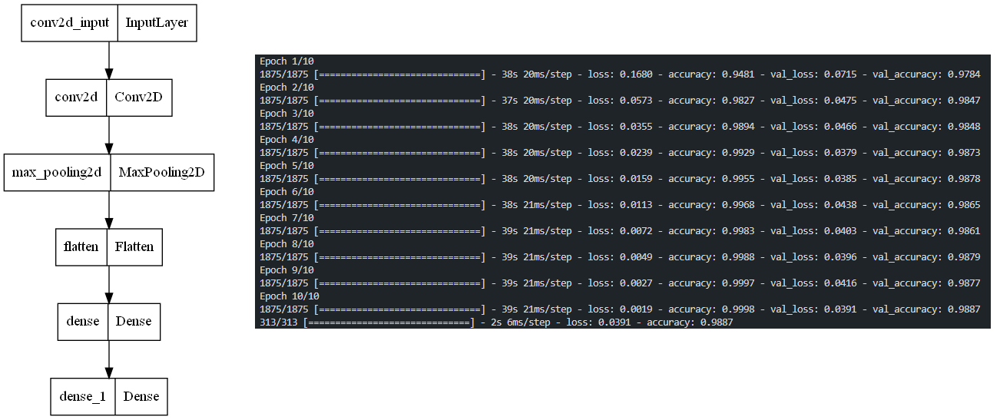

# Draw and Classify your handwritten digit!
A GUI with OpenCV and Tensorflow for drawing and classifying handwritten digit.

The GUI is made by OpenCV2. It allows you to draw digits freely(with "Mouse Event" trick!). <br>
A tensorflow model works as backend to classify each digit you drew.

All files come with detailed documents, so you can inspect the codes comfortably. <br>
Feel free to try it yourself! :)

## Demo:
Look at the app's performance:



## Usage:

Just run ```draw.py```:
```
$ python draw.py
```
- <b>Now draw your digits and press ENTER to classify </b>
- Press Esc to exit the app.

## File Descriptions:
- ```train.py``` is consist of our model (loading and preprocess dataset, training the model and save the model in ```mnist_cnn.h5``` file)
- ```preprocessors.py``` is consist of 3 functions that is used in ```predictions.py``` for preprocess the drawn digits.
- ```predictions.py``` is consist of 2 functions that is used to get predictions for each digit.
- ```draw.py``` is our GUI for drawing digits and viewing our result.

## Note:
The tensorflow model that I used is a simple CNN model. The model is defined in ``` train.py ``` file. Try your preferred model and see how it performs!

The default model:




